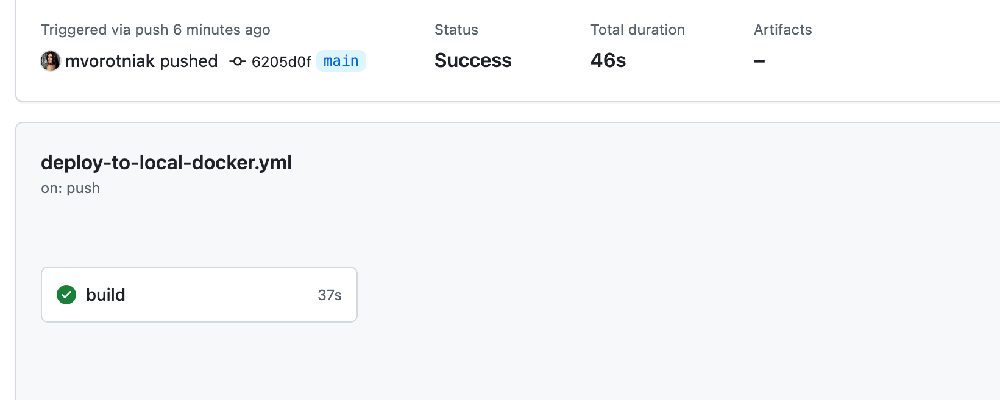

# Github Actions
When a new version of the java application is pushed to the main branch on Github local Docker container of the app is removed and new version is deployed.

### Preparation
- Set Up Self-Hosted Runner: Follow the instructions in GitHub to set up a self-hosted runner on your local machine.
- Create GH Actions workflow file
- Push to main
- Observe results in GH Actions and locally on Docker Desktop

# Elasticsearch autocomplete

### Instructions
1. Run `docker-compose up` so elasticsearch container starts
2. Run the Spring Boot application
3. When the app starts on port 8080, run the command `curl -X POST http://localhost:8080/populate` that will populate elasticsearch with words from https://raw.githubusercontent.com/dwyl/english-words/master/words_alpha.txt
4. Confirm that the words were stored correctly by looking in http://localhost:9200/word/_count (count value should not be 0)
5. Once the database is populated we can search for a word and obtain autocompletes

### Demo
Test the autocomplete passing some string as `word` request param.
Examples with full word, not full word and with typo word:

